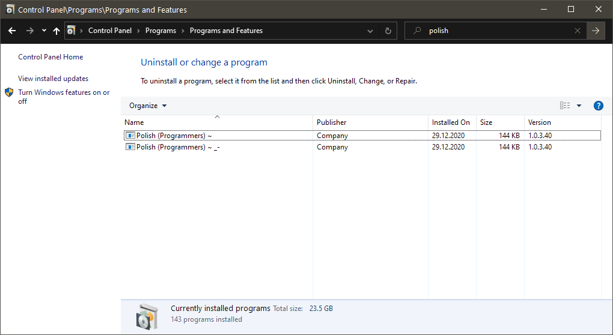

Custom keyboard setups made with Microsoft Keyboard Layout Creator 1.4
There are two variants of Polish (Programmers) layout
- with tilde '\~' changed so it no logner acts as dead key - you don't need to press it twice [(here)](https://github.com/fda0/KeyboardLayouts/releases/download/v1.0.0/build_pl_tilde_not_dead.zip)
- with tilde changed AND '\_' '-' swapped - useful if you program using snake_case_style [(here)](https://github.com/fda0/KeyboardLayouts/releases/download/v1.0.0/build_tilde_not_dead_key_and_underscore_swap.zip)

## Installing
Download .zip from [releases page (here)](https://github.com/fda0/KeyboardLayouts/releases/latest).

Unpack .zip file.

Run setup.exe.

Change your keyboard layout in wonderful Microsoft Windows.

## Uninstalling

